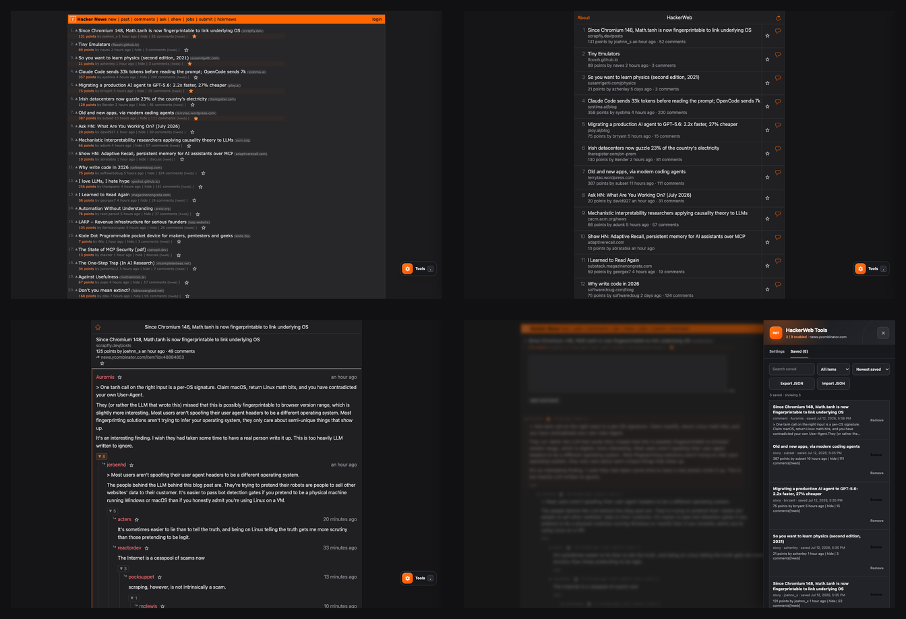
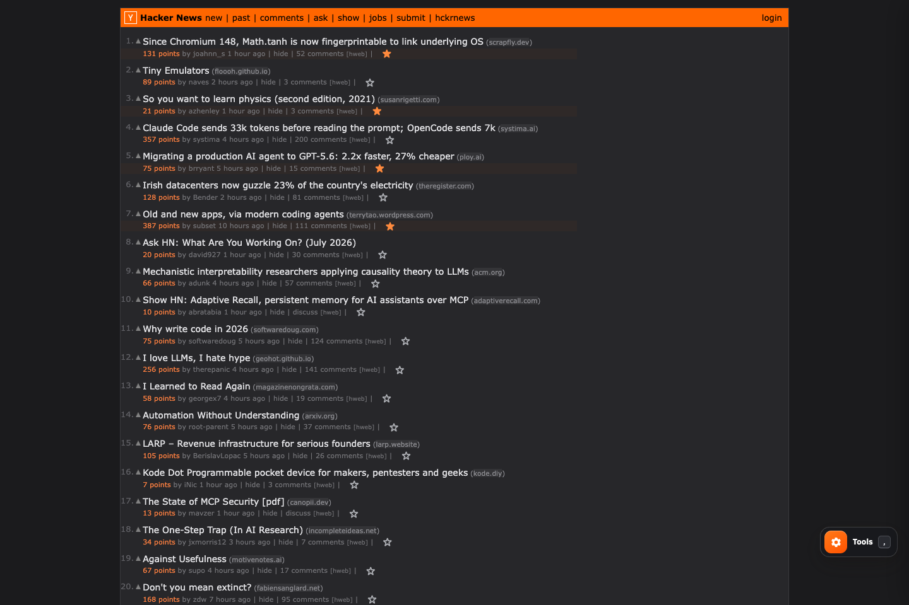
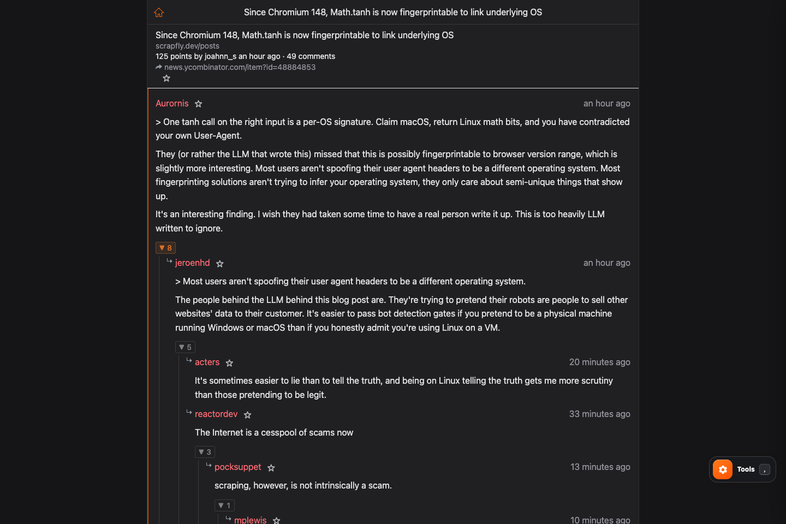
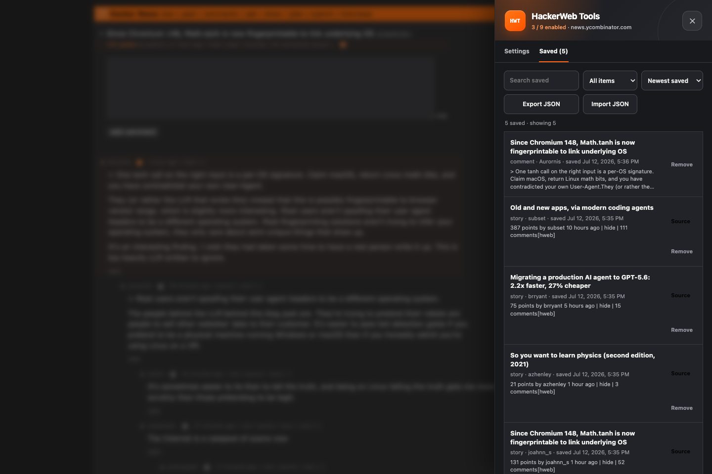
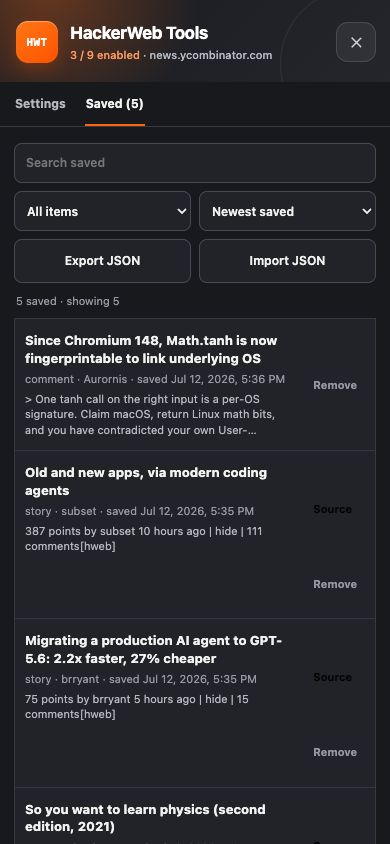
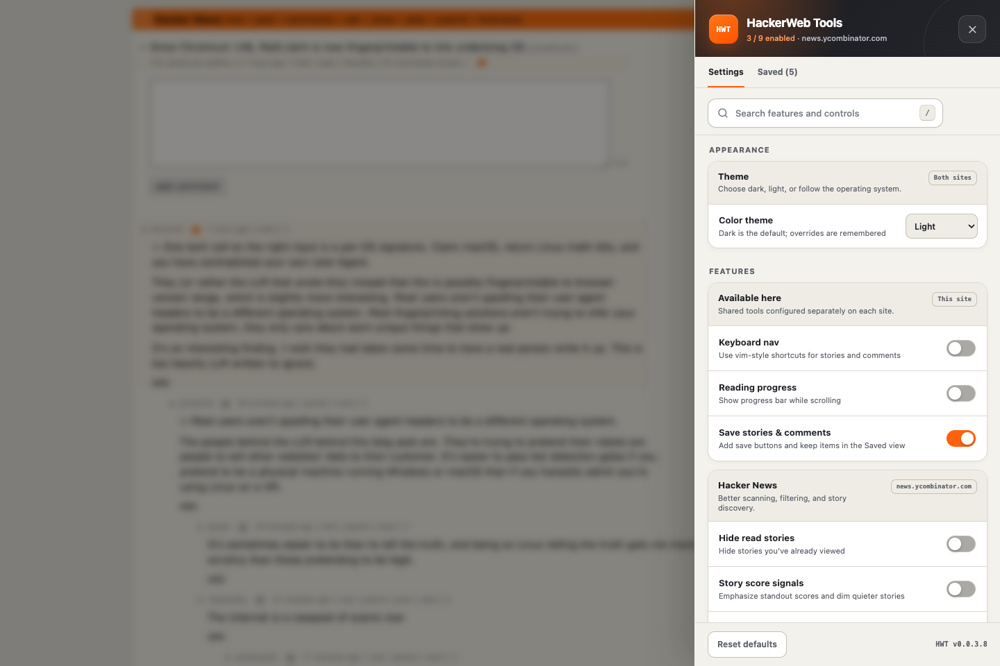

# HackerWeb Tools

A userscript for reading Hacker News and HackerWeb without fighting either
site: readable layouts, real Saved items, reliable thread controls, keyboard
navigation, and dark by default.

**[Install HackerWeb Tools](https://gist.githubusercontent.com/swhitt/0fcf80442f2c0b55c01a90fa3a512df6/raw/hackerweb-tools.user.js)**
— requires [Tampermonkey](https://www.tampermonkey.net/) or
[Violentmonkey](https://violentmonkey.github.io/).



## What changes

### Hacker News, cleaned up

Comfortable line lengths, clear metadata, HackerWeb shortcuts, and one save
button per story. It still looks and behaves like Hacker News.



### HackerWeb threads you can follow

Collapse controls no longer collide with HackerWeb's handlers. Thread rails show
nesting; ancestor highlighting, OP emphasis, and save buttons add context.



### Saved means saved

Stories and comments live in one versioned userscript-storage document shared by
both hosts. Writes are atomic, old bookmarks migrate forward, and failed writes
never leave a fake selected star.

Saved supports:

- Stories and comments from either site
- Search, Story/Comment filters, and newest/oldest/title/type sorting
- JSON export and validated merge import
- Reload persistence and cross-tab updates
- One `Saved` view inside Tools—no second floating button or panel



<p align="center">
  
  
</p>

### Dark by default

Choose **Dark**, **Light**, or **System**. The choice is saved immediately and
reapplied on reload. HackerWeb uses explicit dark colors rather than whole-page
inversion, so images, settings, Saved, progress, and copy feedback keep the
right colors.

Defaults are dark theme, Saved, the HN comfort layout and HackerWeb links, plus
HackerWeb collapsing and OP emphasis. Keyboard navigation, reading progress,
new-comment markers, score signals, time grouping, favicons, hide-read, and
automatic depth collapsing remain opt-in.

## Controls

Open **Tools** or press `,` on either site. The drawer contains two views:

- **Settings** — theme, current-site features, layout, and thresholds
- **Saved** — the shared library, filters, sorting, import, and export

Other useful keys:

| Key       | Action                                      |
| --------- | ------------------------------------------- |
| `,`       | Open or close Tools                         |
| `/`       | Focus Settings search                       |
| `Escape`  | Close Tools                                 |
| `?`       | Show shortcuts when keyboard nav is enabled |
| `j` / `k` | Move through stories or comments            |

Preferences are local to each host. Saved uses shared userscript storage. There
is no HackerWeb Tools account, backend, or sync server.

## Development

Strict TypeScript, Bun, Vite, and `vite-plugin-monkey`:

```sh
bun install
bun run typecheck && bun run lint && bun run format:check
bun run test:run && bun run build
```

Use `bun run build:watch` for local userscript work. See
[CONTRIBUTING.md](CONTRIBUTING.md) for setup and architecture; run
`bun run publish:dry` before a release.

---

Independent project; not affiliated with Y Combinator, Hacker News, or
HackerWeb. [Source](https://github.com/swhitt/hackerweb-tools) ·
[Install gist](https://gist.github.com/swhitt/0fcf80442f2c0b55c01a90fa3a512df6)
